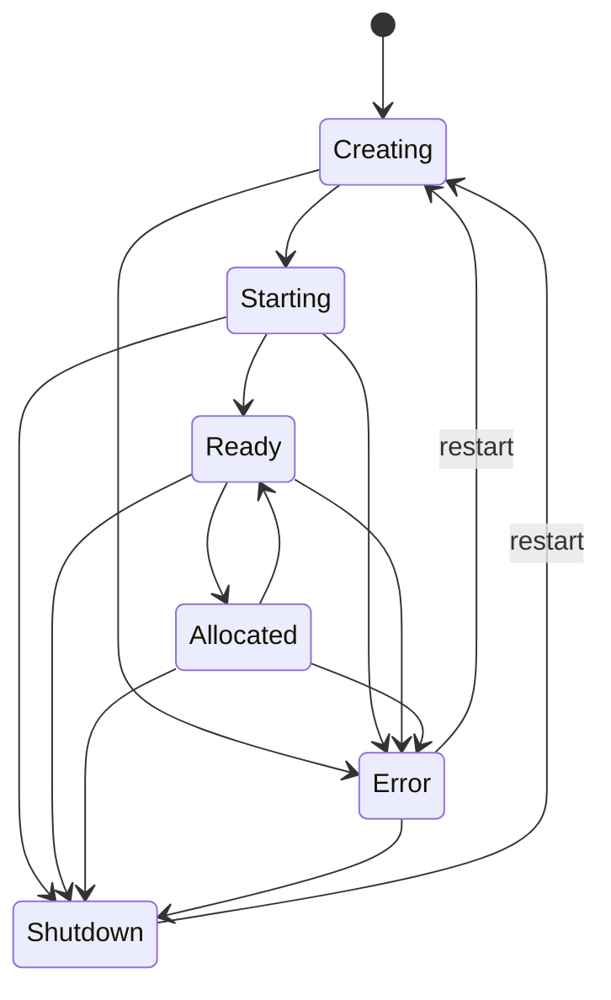
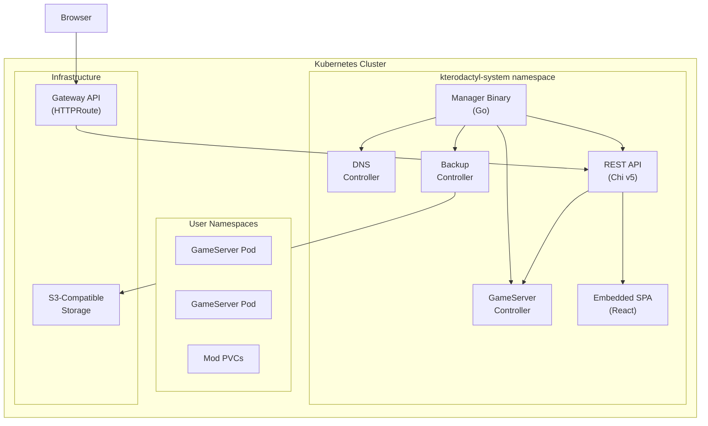

# Phase 12: Documentation - Research

**Researched:** 2026-02-12
**Domain:** Docusaurus documentation site for a Kubernetes operator project
**Confidence:** HIGH

## Summary

Phase 12 creates a Docusaurus v3 documentation site covering installation, configuration, usage workflows, game definition contribution, Helm values reference, and architecture overview. The project already has Docusaurus v3.9.x specified in the stack decisions (`.planning/research/STACK.md`). The existing codebase provides substantial content sources: a well-structured Helm `values.yaml` with comments, a complete game contribution guide at `docs/game-definitions.md`, detailed CRD types with kubebuilder markers, a Chi v5 REST API with clear route definitions, and a React SPA frontend.

The documentation site should live in a `docs-site/` subdirectory (to avoid conflict with the existing `docs/` directory containing the game-definitions guide) as a standalone Docusaurus project with its own `package.json`. The content should be organized following the pattern established by similar Kubernetes operator projects (Agones, Cert-Manager): Overview, Installation, Configuration, Usage Guides, Contributing, and Architecture Reference. Mermaid diagrams are the right choice for architecture visualization (state machine, component diagrams) since Docusaurus has native support via `@docusaurus/theme-mermaid`.

**Primary recommendation:** Scaffold Docusaurus v3 with TypeScript in `docs-site/`, write markdown content organized into 4-5 sidebar categories, use Mermaid for architecture diagrams, and generate the Helm values table from the existing comment annotations in `values.yaml`. No external documentation generation tools (helm-docs) are needed for v1 -- the values.yaml is small enough to document manually, keeping the dependency count low.

## Standard Stack

### Core
| Library | Version | Purpose | Why Standard |
|---------|---------|---------|--------------|
| `@docusaurus/core` | 3.9.x | Static site generator | Meta-backed, production-ready, MDX support, versioning, used by Kubernetes ecosystem projects |
| `@docusaurus/preset-classic` | 3.9.x | Default plugin/theme bundle | Includes docs, blog, pages, search, sitemap out of the box |
| `@docusaurus/theme-mermaid` | 3.9.x | Mermaid diagram rendering | Native Docusaurus integration for state machine and architecture diagrams |
| Node.js | 20+ | Runtime | Required by Docusaurus v3 |
| TypeScript | 5.x | Type-safe config | Already used in the web/ frontend; consistency across project |

### Supporting
| Library | Version | Purpose | When to Use |
|---------|---------|---------|-------------|
| `mermaid` | (peer dep) | Diagram rendering engine | Installed automatically with @docusaurus/theme-mermaid |

### Alternatives Considered
| Instead of | Could Use | Tradeoff |
|------------|-----------|----------|
| Docusaurus | MkDocs (Material) | Python-based, popular for K8s projects too. Docusaurus chosen per project constraint -- React-based, matches frontend stack |
| Docusaurus | VitePress | Lighter weight Vue-based alternative. Not chosen because project is React-based and Docusaurus is already decided |
| Manual Helm docs | helm-docs tool | Auto-generates from values.yaml comments. Overkill for a 135-line values.yaml -- manual table is simpler, no extra tool dependency |
| Mermaid diagrams | Draw.io/SVG images | Mermaid is text-based (version-controlled), renders in Docusaurus natively, easier to maintain |

**Installation:**
```bash
npx create-docusaurus@latest docs-site classic --typescript
cd docs-site
npm install @docusaurus/theme-mermaid
```

## Architecture Patterns

### Recommended Project Structure
```
docs-site/
├── docs/
│   ├── getting-started/
│   │   ├── overview.md            # What is Kterodactyl, features list
│   │   ├── prerequisites.md       # K8s cluster, Helm, kubectl, Gateway API
│   │   └── installation.md        # helm install walkthrough
│   ├── configuration/
│   │   ├── admin-config.md        # AdminConfig ConfigMap settings
│   │   ├── helm-values.md         # Full Helm values reference table
│   │   ├── networking.md          # Gateway API, domain setup, DNS
│   │   ├── backups.md             # S3/MinIO backup configuration
│   │   └── auth.md                # JWT, invitations, SMTP
│   ├── usage/
│   │   ├── creating-servers.md    # UI walkthrough: browse games -> configure -> launch
│   │   ├── managing-servers.md    # Start/stop/restart, console, mods
│   │   ├── backups-restore.md     # On-demand and scheduled backups
│   │   └── admin-tasks.md         # User management, invites, monitoring
│   ├── contributing/
│   │   ├── game-definitions.md    # How to add new games (migrated from docs/)
│   │   ├── development.md         # Local dev setup, make targets, testing
│   │   └── architecture.md        # System architecture, controller design, API design
│   └── reference/
│       ├── api-endpoints.md       # REST API reference (all routes)
│       ├── crd-reference.md       # GameServer and Backup CRD specs
│       └── metrics.md             # Prometheus metrics reference
├── src/
│   └── pages/
│       └── index.tsx              # Landing page
├── static/
│   └── img/                       # Logo, screenshots
├── docusaurus.config.ts           # Site configuration
├── sidebars.ts                    # Sidebar navigation
├── package.json
└── tsconfig.json
```

### Pattern 1: Sidebar Organization with Categories
**What:** Group docs into logical categories with collapsible sidebar sections.
**When to use:** Always -- this is the standard Docusaurus navigation pattern.
**Example:**
```typescript
// sidebars.ts
const sidebars = {
  docs: [
    {
      type: 'category',
      label: 'Getting Started',
      items: ['getting-started/overview', 'getting-started/prerequisites', 'getting-started/installation'],
    },
    {
      type: 'category',
      label: 'Configuration',
      items: ['configuration/helm-values', 'configuration/admin-config', 'configuration/networking', 'configuration/backups', 'configuration/auth'],
    },
    {
      type: 'category',
      label: 'Usage',
      items: ['usage/creating-servers', 'usage/managing-servers', 'usage/backups-restore', 'usage/admin-tasks'],
    },
    {
      type: 'category',
      label: 'Contributing',
      items: ['contributing/game-definitions', 'contributing/development', 'contributing/architecture'],
    },
    {
      type: 'category',
      label: 'Reference',
      items: ['reference/api-endpoints', 'reference/crd-reference', 'reference/metrics'],
    },
  ],
};
```

### Pattern 2: Mermaid Diagrams for Architecture
**What:** Use Mermaid code blocks in markdown for state machines, component diagrams, and flow diagrams.
**When to use:** Architecture overview, state machine documentation, request flow diagrams.
**Example:**
```markdown
## GameServer State Machine


```

### Pattern 3: Admonitions for Important Notes
**What:** Use Docusaurus admonition syntax for warnings, tips, and important information.
**When to use:** Prerequisites, security warnings, version compatibility notes.
**Example:**
```markdown
:::warning CRD Upgrades
Helm does not upgrade CRDs automatically. After chart upgrades, apply CRDs manually:
```bash
kubectl apply -f chart/crds/
```
:::

:::tip First Admin User
After installation, bootstrap your first admin user via the API before using the UI.
:::
```

### Pattern 4: Tabs for Multi-Platform/Method Instructions
**What:** Use Docusaurus Tabs component when showing alternatives (e.g., Helm install vs. kubectl, different cloud providers).
**When to use:** Installation methods, cloud-specific instructions, configuration alternatives.

### Anti-Patterns to Avoid
- **Duplicating code as documentation:** Reference the actual source files where possible; don't copy-paste Go types into docs that will go stale.
- **Auto-generating everything:** For a project this size, hand-written docs with clear examples are better than generated API docs that lack context.
- **Skipping the landing page:** The index page should immediately communicate what Kterodactyl is and how to get started -- not just be a redirect to /docs.
- **Versioning docs prematurely:** The project is at v0.1.0; do not set up doc versioning until there is a v1.0 release. Versioning adds complexity with no current benefit.

## Don't Hand-Roll

| Problem | Don't Build | Use Instead | Why |
|---------|-------------|-------------|-----|
| Static site generation | Custom build pipeline | Docusaurus `npm run build` | Handles SSG, routing, search indexing, sitemap generation |
| Diagram rendering | SVG/PNG images | Mermaid in Docusaurus | Text-based, version-controlled, auto-themed for dark/light mode |
| Sidebar navigation | Custom nav component | `sidebars.ts` config | Auto-generates from config, supports collapsible categories |
| Search | Custom search | Docusaurus built-in search or Algolia | Works out of the box with static content |
| Code syntax highlighting | Custom highlighter | Docusaurus Prism integration | Supports Go, YAML, TypeScript, bash out of the box |
| Responsive layout | Custom CSS | Docusaurus classic theme | Mobile-friendly by default |

**Key insight:** Docusaurus handles all the infrastructure concerns. The actual work is content authoring -- writing clear, accurate markdown files. No custom React components are needed for v1.

## Common Pitfalls

### Pitfall 1: Placing Docusaurus in existing `docs/` directory
**What goes wrong:** The project already has a `docs/` directory containing `game-definitions.md`. Scaffolding Docusaurus at the project root would conflict, and scaffolding inside `docs/` would mix content with the Docusaurus project structure.
**Why it happens:** The default Docusaurus scaffold assumes a fresh project or a dedicated `docs/` directory.
**How to avoid:** Use `docs-site/` as the Docusaurus project root. The existing `docs/game-definitions.md` content should be migrated into the Docusaurus content at `docs-site/docs/contributing/game-definitions.md`.
**Warning signs:** Build errors about duplicate routes, confusion between the project-level `docs/` and Docusaurus's `docs/` directory.

### Pitfall 2: Values table going stale
**What goes wrong:** The Helm values reference in the documentation diverges from the actual `chart/values.yaml` over time.
**Why it happens:** Manual documentation is not automatically synced with code changes.
**How to avoid:** For v1, the values.yaml is 135 lines and stable. Document it once thoroughly. Add a comment in `chart/values.yaml` reminding contributors to update docs when changing values. In v2, consider integrating helm-docs or a CI check.
**Warning signs:** Users reporting incorrect default values in documentation.

### Pitfall 3: Writing documentation that duplicates NOTES.txt
**What goes wrong:** The Helm NOTES.txt already provides post-install instructions. Duplicating this in docs creates two sources of truth.
**Why it happens:** Natural inclination to be thorough.
**How to avoid:** Reference NOTES.txt content but expand on it. NOTES.txt is for quick post-install orientation; docs should provide deeper explanation, context, and troubleshooting.
**Warning signs:** Same kubectl commands appearing in both places with slightly different formatting.

### Pitfall 4: MDX compilation errors from bad formatting
**What goes wrong:** Docusaurus uses MDX which is stricter than regular markdown. Unescaped JSX-like syntax (angle brackets, curly braces) causes build failures.
**Why it happens:** Kubernetes resource examples contain `<namespace>`, `{variable}` patterns that MDX interprets as JSX.
**How to avoid:** Always use code blocks (triple backtick) for any content containing angle brackets or curly braces. Never put raw `<placeholder>` text in prose -- use backtick inline code instead.
**Warning signs:** `MDXError: Unexpected token` during `npm run build`.

### Pitfall 5: Premature versioning
**What goes wrong:** Setting up doc versioning at v0.1.0 creates maintenance burden with no benefit.
**Why it happens:** Docusaurus promotes versioning as a feature, and it seems professional to have it.
**How to avoid:** Wait until there is a v1.0 release with breaking changes before versioning. For now, "latest" is the only version.
**Warning signs:** Multiple version directories with identical content.

## Code Examples

Verified patterns from official sources:

### Docusaurus Configuration (docusaurus.config.ts)
```typescript
// Source: https://docusaurus.io/docs/api/docusaurus-config
import type {Config} from '@docusaurus/types';
import type * as Preset from '@docusaurus/preset-classic';

const config: Config = {
  title: 'Kterodactyl',
  tagline: 'Self-service game server management for Kubernetes',
  favicon: 'img/favicon.ico',
  url: 'https://kterodactyl.github.io',
  baseUrl: '/kterodactyl/',
  organizationName: 'kterodactyl',
  projectName: 'kterodactyl',
  onBrokenLinks: 'throw',
  onBrokenMarkdownLinks: 'warn',

  markdown: {
    mermaid: true,
  },
  themes: ['@docusaurus/theme-mermaid'],

  presets: [
    [
      'classic',
      {
        docs: {
          sidebarPath: './sidebars.ts',
          editUrl: 'https://github.com/kterodactyl/kterodactyl/tree/main/docs-site/',
        },
        blog: false, // Disable blog for now
        theme: {
          customCss: './src/css/custom.css',
        },
      } satisfies Preset.Options,
    ],
  ],

  themeConfig: {
    navbar: {
      title: 'Kterodactyl',
      items: [
        {type: 'docSidebar', sidebarId: 'docs', position: 'left', label: 'Docs'},
        {href: 'https://github.com/kterodactyl/kterodactyl', label: 'GitHub', position: 'right'},
      ],
    },
    footer: {
      style: 'dark',
      links: [
        {title: 'Docs', items: [{label: 'Getting Started', to: '/docs/getting-started/overview'}]},
        {title: 'Community', items: [{label: 'GitHub', href: 'https://github.com/kterodactyl/kterodactyl'}]},
      ],
      copyright: `Copyright ${new Date().getFullYear()} Kterodactyl Contributors.`,
    },
    prism: {
      additionalLanguages: ['bash', 'yaml', 'go', 'typescript'],
    },
    mermaid: {
      theme: {light: 'neutral', dark: 'dark'},
    },
  } satisfies Preset.ThemeConfig,
};

export default config;
```

### Helm Values Reference Table Pattern
```markdown
## Core Settings

| Parameter | Description | Default |
|-----------|-------------|---------|
| `replicaCount` | Number of operator replicas (should be 1 with leader election) | `1` |
| `image.repository` | Container image repository | `ghcr.io/kterodactyl/kterodactyl` |
| `image.pullPolicy` | Image pull policy | `IfNotPresent` |
| `image.tag` | Image tag (defaults to chart appVersion) | `""` |

## AdminConfig

| Parameter | Description | Default |
|-----------|-------------|---------|
| `adminConfig.limits.maxServersGlobal` | Maximum GameServers cluster-wide | `"100"` |
| `adminConfig.limits.maxServersPerUser` | Maximum GameServers per user | `"5"` |
```

### Architecture Component Diagram
```markdown

```

## State of the Art

| Old Approach | Current Approach | When Changed | Impact |
|--------------|------------------|--------------|--------|
| Docusaurus v2 | Docusaurus v3.9.x | 2024 | React 18/19 support, MDX v3, faster builds, better TypeScript support |
| `docusaurus.config.js` | `docusaurus.config.ts` | Docusaurus 3.x | Native TypeScript config support (no compilation step needed) |
| Manual diagram images | Mermaid in markdown | Docusaurus 3.4+ | `@docusaurus/theme-mermaid` is now official, text-based diagrams are maintainable |
| Webpack bundler | Rspack (experimental) | Docusaurus 3.9 | 2-5x faster builds with `experimental_faster.rspackBundler` flag |

**Deprecated/outdated:**
- Docusaurus v2: Still works but v3 is current. Always use v3 for new projects.
- `@mdx-js/mdx` v1: Docusaurus v3 uses MDX v3 which has stricter parsing rules.
- Blog feature for docs-only sites: Can be disabled via `blog: false` in preset config.

## Content Inventory

Existing content sources in the codebase that should inform documentation:

| Source | Location | Maps to Doc |
|--------|----------|-------------|
| Game contribution guide | `docs/game-definitions.md` | `contributing/game-definitions.md` |
| Helm values with comments | `chart/values.yaml` | `configuration/helm-values.md` |
| NOTES.txt post-install | `chart/templates/NOTES.txt` | `getting-started/installation.md` |
| CRD type definitions | `api/v1alpha1/gameserver_types.go` | `reference/crd-reference.md` |
| CRD type definitions | `api/v1alpha1/backup_types.go` | `reference/crd-reference.md` |
| State machine transitions | `api/v1alpha1/gameserver_lifecycle.go` | `contributing/architecture.md` |
| API route definitions | `internal/api/routes.go` | `reference/api-endpoints.md` |
| Prometheus metrics | `internal/metrics/metrics.go` | `reference/metrics.md` |
| Minecraft manifest | `games/minecraft/manifest.yaml` | `contributing/game-definitions.md` |
| Sample CRs | `config/samples/*.yaml` | `getting-started/installation.md`, `reference/crd-reference.md` |
| Makefile targets | `Makefile` | `contributing/development.md` |
| Dockerfile | `Dockerfile` | `contributing/development.md` |
| README.md (template) | `README.md` | To be updated with link to docs site |

## Open Questions

1. **GitHub Pages vs. other hosting for the docs site**
   - What we know: The project uses GitHub (`https://github.com/kterodactyl/kterodactyl`). Docusaurus has native GitHub Pages deployment support.
   - What's unclear: Whether the docs should be deployed to GitHub Pages, a custom domain, or just built as part of the project without deployment.
   - Recommendation: Configure for GitHub Pages deployment (`https://kterodactyl.github.io/kterodactyl/`). It is the simplest option and can be changed later. The planner should include the build step but deployment can be deferred to a CI/CD pipeline outside the scope of this phase.

2. **Search integration**
   - What we know: Docusaurus supports local search plugins and Algolia DocSearch. Algolia is free for open-source projects.
   - What's unclear: Whether to set up search in v1 or defer it.
   - Recommendation: Use the built-in Docusaurus search (no external service). The site will have ~15 pages -- manual navigation via sidebar is sufficient. Algolia can be added later if needed.

3. **Whether to update the existing README.md**
   - What we know: The current README.md is the Kubebuilder template with TODO placeholders.
   - What's unclear: Whether updating the README is in scope for this phase.
   - Recommendation: The README should be updated to provide a concise project overview and link to the docs site. This is a natural part of "documentation" phase scope.

## Sources

### Primary (HIGH confidence)
- [Docusaurus Official Docs - Installation](https://docusaurus.io/docs/installation) - Project structure, scaffolding command, Node.js requirements
- [Docusaurus Official Docs - Configuration](https://docusaurus.io/docs/api/docusaurus-config) - docusaurus.config.js structure and options
- [Docusaurus Official Docs - Diagrams](https://docusaurus.io/docs/next/markdown-features/diagrams) - Mermaid integration setup
- Codebase inspection: `chart/values.yaml`, `api/v1alpha1/*_types.go`, `internal/api/routes.go`, `internal/metrics/metrics.go`, `docs/game-definitions.md`, `Makefile`
- Project stack decisions: `.planning/research/STACK.md` - Docusaurus v3.9.x confirmed

### Secondary (MEDIUM confidence)
- [Agones Documentation Site](https://agones.dev/site/docs/) - Verified documentation organization pattern for K8s game server operator
- [helm-docs GitHub](https://github.com/norwoodj/helm-docs) - Verified tool for auto-generating Helm values docs (decided against for v1)
- [Docusaurus Versions page](https://docusaurus.io/versions) - Confirmed v3.9.2 is current stable

### Tertiary (LOW confidence)
- None. All findings verified against primary sources.

## Metadata

**Confidence breakdown:**
- Standard stack: HIGH - Docusaurus v3.9.x confirmed in project STACK.md and verified against official docs. Mermaid confirmed as official theme.
- Architecture: HIGH - Project structure derived from Docusaurus official docs and verified against similar K8s operator projects (Agones).
- Pitfalls: HIGH - MDX strictness, versioning overhead, and directory conflicts are well-documented in Docusaurus issue tracker and community discussions.
- Content plan: HIGH - Based on direct inspection of every relevant source file in the codebase.

**Research date:** 2026-02-12
**Valid until:** 2026-03-14 (30 days -- Docusaurus is stable, unlikely to have breaking changes)
