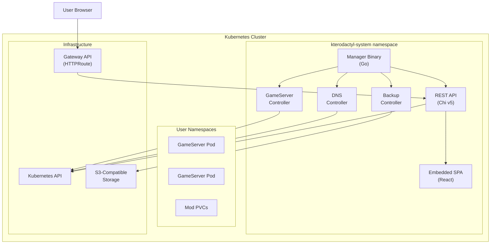
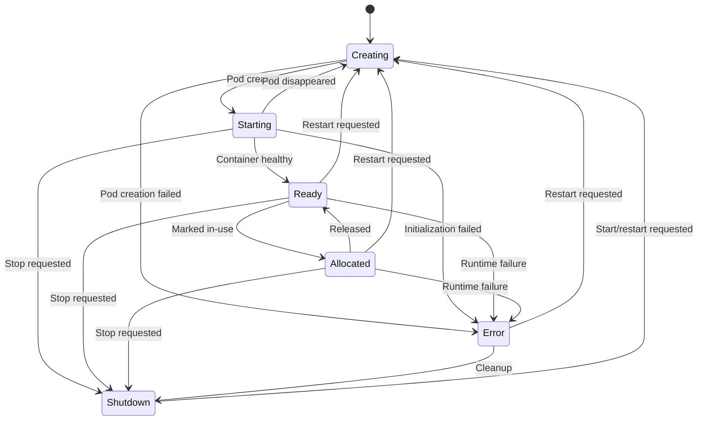
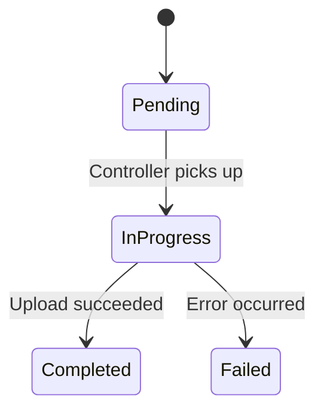
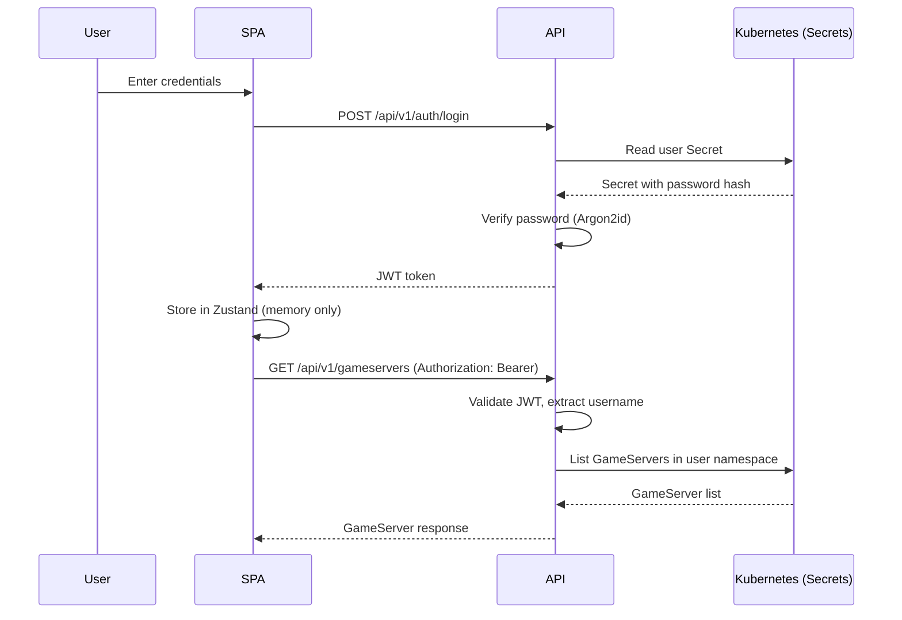

# Architecture Overview

This document describes the system architecture of Kterodactyl, including the component design, controller patterns, state machines, and API design.

## Component Diagram

The operator runs as a single manager binary containing multiple controllers and an embedded REST API with SPA frontend.



### Manager Binary

The manager binary (`cmd/main.go`) is the single deployment artifact. It starts:

- **controller-runtime Manager**: Runs all three reconcilers with leader election
- **REST API Server**: Runs as a manager `Runnable` for coordinated lifecycle management
- **Game Manifest Loader**: Reads game definitions from the embedded `games/` directory at startup

All components share the same Kubernetes client cache for efficient resource watching.

## Dual-Controller Pattern

Kterodactyl uses a dual-controller pattern where two reconcilers watch the same `GameServer` CRD:

1. **GameServer Controller**: Manages Pod lifecycle, state transitions, resource creation and cleanup
2. **DNS Controller**: Manages Service and HTTPRoute resources for network accessibility

Both controllers are registered with `Named()` disambiguation so controller-runtime can distinguish them. The GameServer Controller handles the core lifecycle, while the DNS Controller reacts to state transitions to create or clean up networking resources.

This separation keeps each controller focused on a single concern while sharing the same CRD type.

## GameServer State Machine

The GameServer lifecycle follows a 6-state machine with defined transitions:



### State Descriptions

| State | Pod Exists | Description |
|-------|-----------|-------------|
| **Creating** | Being created | Operator is building Pod, Service, HTTPRoute, and PVC resources |
| **Starting** | Running | Pod exists but the game server process is still initializing |
| **Ready** | Running | Game server is fully operational and accepting connections |
| **Allocated** | Running | Server is marked as in-use for an active session |
| **Shutdown** | No | Server has been stopped; GameServer resource preserved for restart |
| **Error** | Varies | Something went wrong; check conditions for details |

### Key Design Decisions

- **Pod RestartPolicy=Never**: The operator manages the full lifecycle. Kubelet does not restart failed containers.
- **Restart goes through Creating**: Restarting a server tears down the Pod and creates a fresh one, ensuring clean state.
- **Error recovery**: Servers in Error state can be restarted (Error to Creating) or shut down (Error to Shutdown).

## Backup State Machine

Backups follow a 4-state lifecycle:



### Backup Process

The Backup Controller performs the entire backup operation:

1. Reads data from the game server Pod (tar archive of the backup paths)
2. Compresses the archive with gzip
3. Uploads to the configured S3-compatible storage (MinIO, AWS S3, etc.)
4. Records the S3 key, bucket, and size in the Backup status

This operator-driven approach avoids CronJobs and cross-namespace credential distribution.

## REST API Design

The API server uses [Chi v5](https://github.com/go-chi/chi) with a layered middleware stack:

### Middleware Stack

```
Request Flow:
  RequestID -> RealIP -> Logger -> Recoverer -> CORS -> Rate Limit
    -> [Public routes: /healthz, /readyz, /auth/login, /auth/register]
    -> [WebSocket: /gameservers/{name}/console (JWT via query param)]
    -> Metrics -> Timeout(30s) -> Authenticate
      -> [Authenticated routes: games, gameservers, mods, backups]
      -> RequireAdmin
        -> [Admin routes: invites, users, backup-schedule, delete backup, restore]
```

### Key Design Patterns

- **Namespace-per-user isolation**: Each user's servers are created in their own Kubernetes namespace. The API scopes all queries to the authenticated user's namespace.
- **JWT authentication**: HS256-signed tokens with 2-hour refresh threshold. The middleware issues fresh tokens when expiry is approaching.
- **Per-request AdminConfig**: The `AdminConfig` ConfigMap is loaded on every API request, not cached. This allows administrators to change settings without restarting the operator.
- **Rate limiting**: Global limit of 100 requests/minute/IP, with tighter per-endpoint limits on login (5/min), registration (3/min), and server creation (10/min).

### Embedded SPA

The React frontend is embedded into the Go binary using `go:embed`. The SPA catch-all route (`r.NotFound(serveSPA().ServeHTTP)`) serves the frontend for any route not matched by API handlers. API routes always take priority.

## Game Manifest System

Game definitions follow a directory-per-game pattern:

```
games/
  minecraft/
    manifest.yaml    # Game definition with JSON Schema
    Dockerfile       # Container image specification
```

### Schema-Driven Forms

Each manifest includes a `parameterSchema` field containing a JSON Schema (Draft 2020-12) definition. This schema serves dual purpose:

1. **Backend validation**: Parameters are validated against the compiled schema before server creation or update
2. **Frontend form generation**: The schema is passed through the API as raw JSON. The React frontend uses `react-jsonschema-form` to render dynamic configuration forms.

Schemas are compiled once at startup using `santhosh-tekuri/jsonschema/v6` and cached on the `GameManifest` struct for efficient per-request validation.

### Parameter Design

All parameters use `type: string` because they are passed as container environment variables. Constraints like `enum`, `pattern`, `const`, and `maxLength` enforce value formats within the string type.

## Authentication Flow



### User Storage

Users are stored as Kubernetes Secrets (not a database):

- Secret name: `user-<username>`
- Labels for efficient querying: `kterodactyl.io/component: user`, `kterodactyl.io/username: <username>`
- Data fields: username, email, password hash (Argon2id, OWASP parameters), role, created timestamp

### Security Decisions

- **Argon2id** with OWASP parameters (time=1, memory=64MB, threads=4) for password hashing
- **HS256 JWT** signing (single service signs and verifies)
- **JWT in Zustand memory only** (not localStorage) -- token lost on page refresh
- **WebSocket auth via query parameter** because browser WebSocket API cannot set Authorization headers

## Multi-Tenant Isolation

Kterodactyl provides namespace-per-user isolation:

- Each user gets a dedicated Kubernetes namespace
- API handlers scope all operations to the authenticated user's namespace
- RBAC ensures the operator can manage resources across namespaces
- NetworkPolicy on game server Pods allows DNS and internet access but blocks private network ranges
